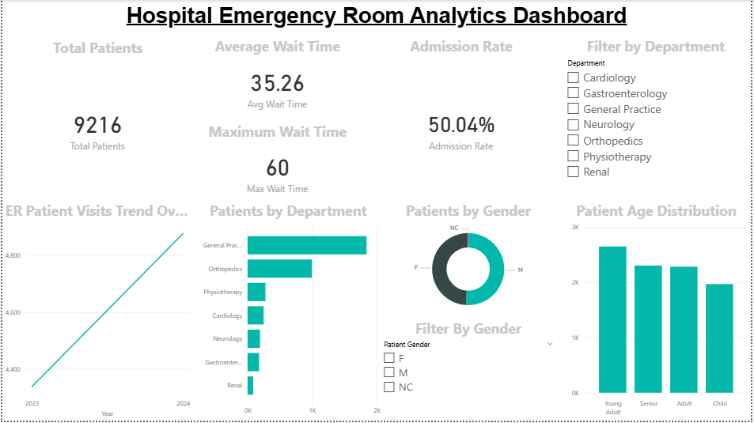

# Healthcare ER Wait Time Analytics Dashboard

## Project Overview
This project analyzes Emergency Room (ER) patient data to understand patient wait times, department workload, and demographic patterns using Power BI.

## Tools Used
Power BI
Excel
Data Visualization
Data Analysis

## Key Metrics
Total Patients: 9,216
Average Wait Time: 35 minutes
Maximum Wait Time: 60 minutes
Admission Rate: 50%

## Dashboard Insights
- The General department receives the highest number of ER patients.
- Patient distribution across genders is relatively balanced.
- Young Adult and Adult groups represent the largest portion of ER visits.
- Approximately half of ER patients require hospital admission.

## Dashboard Preview

